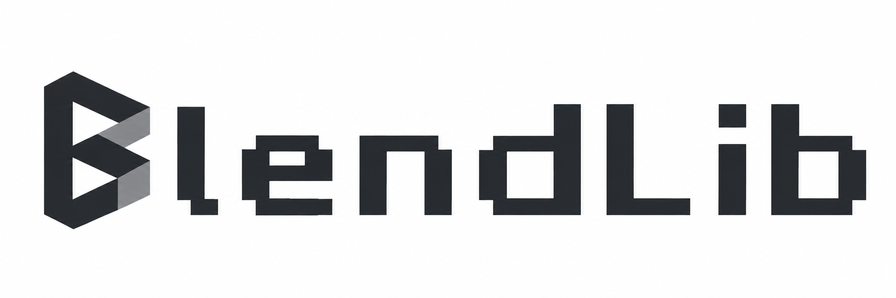

<p align="center">
  
</p>

<p align="center"><strong>Bring your models to life in Minecraft.</strong><br>让模型走进 Minecraft，让创意动起来。</p>

<p align="center">
  <a href="https://www.curseforge.com/minecraft/mc-mods/blendlib">CurseForge</a> ·
  <a href="https://github.com/LIy-hub/BlendLib-Public/releases/tag/v1.0.0-beta.2">Download Beta.2</a> ·
  <a href="./docs/release/README.md">Documentation</a> ·
  <a href="https://github.com/LIy-hub/BlendLib-Public/issues">Report an issue</a> ·
  <a href="#中文简介">中文简介</a>
</p>

BlendLib is a **GLB 2.0 model and animation library for Minecraft Fabric**. It connects an
artist's Blender workflow to a mod's runtime: export a supported model, bind it to your mod,
and drive its movement with animation and pose APIs.

**For players:** install BlendLib when a mod requires it. **For developers:** use it as the
model and animation layer for your own content. BlendLib is a library; installing it alone
does not add creatures, items or gameplay.

## From model to motion

- **Models with structure.** Load rigid and skinned models through a validated GLB 2.0 asset pipeline.
- **Animation with control.** Work with keyframe animation, procedural poses, sockets and animation events.
- **A place in your mod.** Bind models to entity, block-entity and item hosts, with APIs for animation synchronization.
- **Tools for iteration.** Use the separate Blender exporter, resource reload support and diagnostics to refine your assets.

**Workflow:** Blender → supported GLB + descriptor + textures → your Fabric mod → model and animation runtime.
See the [export checklist](./docs/release/blender-export-checklist-v1.md) for the supported asset profiles.
BlendLib implements a strict GLB subset, rather than every glTF feature.

## Install

**Current public release: 1.0.0-beta.2 · Fabric · 15 Minecraft versions.**

| Minecraft Java Edition | Java runtime |
| --- | --- |
| 1.21.1, 1.21.2, 1.21.3, 1.21.4, 1.21.5, 1.21.6, 1.21.7, 1.21.8, 1.21.9, 1.21.10, 1.21.11 | Java 21 |
| 26.1, 26.1.1, 26.1.2, 26.2 | Java 25 |

1. Install **Fabric Loader 0.19.3 or newer** and **Fabric API for your exact Minecraft version**.
2. Download the matching BlendLib **runtime** JAR from [CurseForge](https://www.curseforge.com/minecraft/mc-mods/blendlib/files/all)
   or [GitHub Releases](https://github.com/LIy-hub/BlendLib-Public/releases/tag/v1.0.0-beta.2).
3. Put it in your instance's `mods` folder alongside the mod that requires BlendLib.

Use **one** BlendLib runtime JAR. Each `1.0.0-beta.2+<Minecraft version>` file targets one exact
game version; source JARs are for developers. The runtime already includes BlendLib's API, core,
common and client modules. Follow the dependent mod's instructions for client/server installation.

The [release notes](./docs/release/beta2-release-notes.md) list tested Fabric API versions.
Runtime JARs, sources and SHA-256 checksums are available in the GitHub release.

## Build with BlendLib

| Start here | What you will find |
| --- | --- |
| [Documentation](./docs/release/README.md) | Release, integration and troubleshooting links |
| [Blender export checklist](./docs/release/blender-export-checklist-v1.md) | Supported profiles, asset layout and export validation |
| [Fabric 26.1.2 integration tutorial](./docs/release/developer-tutorial-26.1.2.md) | Model keys, animation calls and host integration; examples originate from the Alpha API baseline |
| [Diagnostics and troubleshooting](./docs/release/diagnostic-troubleshooting-v1.md) | Diagnose asset and integration problems |
| [Beta.2 version notes](./docs/release/beta2-release-notes.md) | Dependencies and native adapter differences |
| [Contributing](./CONTRIBUTING.md) | Project contribution guidance |

Compile against the runtime for your target Minecraft version: native rendering callback
signatures differ between releases. The separate Blender exporter requires **Blender 5.1+**;
Beta.2 leaves it unchanged, and its package remains available in the
[Beta.1 release](https://github.com/LIy-hub/BlendLib-Public/releases/tag/v1.0.0-beta.1%2B26.1.2).

To build a Beta.2 target locally, install the Java 21 and Java 25 toolchains and use:

```powershell
.\gradlew.bat -p versions/legacy "-Pminecraft_version=1.21.1" build
.\gradlew.bat -p versions/modern "-Pminecraft_version=1.21.11" build
.\gradlew.bat -p versions/modern "-Pminecraft_version=26.2" build
```

Outputs are under `versions/<legacy or modern>/build/<Minecraft version>/libs/`.
The root build remains the 26.1.2 Beta.1 baseline; see the
[release documentation](./docs/release/README.md) for that build and historical evidence.

## Beta status and scope

BlendLib is in active Beta. APIs and behavior can change, and there is no stable API/ABI guarantee.
Test integrations in a separate instance before adopting them in a modpack.

- **Formats:** runtime models must be supported `.glb` assets. `.blend`, FBX, OBJ and external `.gltf` + `.bin` are not loaded directly.
- **Platforms:** this release supports Fabric. NeoForge and cross-version JAR compatibility are outside its scope.
- **Gameplay:** visual models and animation events do not decide server-authoritative collision, damage, hits or drops.
- **Validation:** the 15-version release record covers builds, JAR checks, isolated server checks and client startup/resource reload. These checks did not enter a world. Full visual coverage, multiplayer behavior, repeated-reload leak testing, Iris/Sodium compatibility, experimental GPU rendering and hardware performance remain unverified or incomplete. Older adapters exclude unsupported experimental GPU paths.

See the [verification matrix](./docs/release/multiversion-progress.md) and
[Beta.1 capability boundaries](./docs/release/beta-release-notes.md) for the detailed evidence.

## 中文简介

**BlendLib 是 Minecraft Fabric 的 GLB 2.0 模型与动画前置库。** 从 Blender 中的网格、骨骼和关键帧出发，
通过受支持的导出流程，将模型接入你自己的模组。它提供模型加载、动画、程序化姿态、挂点与事件、
宿主绑定、动画同步、资源重载和诊断能力，让创作与游戏内呈现衔接起来。

玩家只需在依赖它的模组要求时安装；开发者可以围绕它构建自己的模型和动画内容。
单独安装本库不会添加生物、物品或玩法。Beta.2 覆盖上表 15 个游戏版本：1.21.x 使用 Java 21，
26.x 使用 Java 25，并需要 Fabric Loader 0.19.3+ 和对应版本的 Fabric API。
**只安装一份与游戏版本精确匹配的运行库 JAR。**

项目仍处于 Beta，API 与行为可能变化。构建和启动检查不等于完整的游戏内画面、多人、
光影兼容或性能验收；模型与动画也不承担服务端碰撞、伤害等权威玩法判定。
开发入口见[文档导航](./docs/release/README.md)，详细支持范围见 [Beta.2 发布说明](./docs/release/beta2-release-notes.md)。

## License and credits

Created by [LIy-hub](https://github.com/LIy-hub) · CurseForge: [Liy_Hub](https://www.curseforge.com/members/liy_hub/projects).

Non-add-on code is licensed under [Apache-2.0](./LICENSE), with notices in [NOTICE](./NOTICE).
The separate Blender add-on is [GPL-3.0-or-later](./blender-addon/LICENSE).
The official faceted B icon and pixel wordmark are available in the [brand assets](./docs/assets/branding/README.md).
