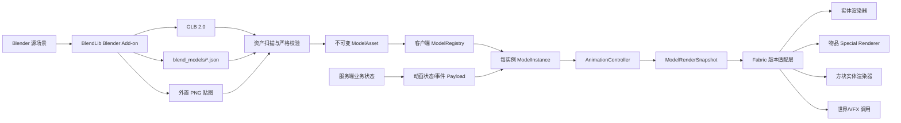

# BlendLib 总体架构

## 1. 背景与约束

当前环境同时存在两个需要隔离的 Minecraft 渲染目标：

- 当前服务器包：Minecraft 26.1.2、Fabric Loader 0.19.3、Fabric API `0.154.2+26.1.2`。
- 当前 LiyMod 工作区：Minecraft 26.2、Fabric Loader 0.19.3、Loom 1.15.5。

Minecraft 的渲染 API 正在向 RenderState、提交队列和后端抽象迁移。BlendLib 因此必须把模型/动画核心与 Minecraft 版本适配层隔离，不能以“一个 JAR 跨 26.1.2 和 26.2”为目标。

现有 LiyMod 已证明以下方向可行：

- GLB/GLTF 资源可以从资源管理器加载。
- 刚体节点可以映射为骨骼并播放节点变换动画。
- 模型描述 JSON 可以承载 clip、状态机和材质配置。
- `SubmitNodeCollector` 路径可以复用同一动画模型渲染器。
- 资源重载、姿态缓存、物品 special renderer、实体层和方块实体渲染均能接入。

这些代码是行为参考和测试样本，不直接作为 BlendLib 公共 API。

## 2. 目标

### 2.1 产品目标

- 让模组开发者不必理解 GLB accessor、骨骼矩阵或顶点提交细节。
- 让 Blender 美术资产通过确定性的导出配置进入 Fabric。
- 让一份模型资源可以挂载到多个 Minecraft 渲染入口。
- 让资源包能够覆盖模型描述、GLB 和贴图，并支持安全热重载。
- 让动画触发具有可选的服务端权威同步，同时保持渲染完全客户端化。
- 让版本升级主要影响 Fabric adapter，而不是资产、动画或控制器核心。

### 2.2 工程目标

- 严格客户端/服务端类边界。
- 可单元测试的纯 Java 模型与动画核心。
- 无渲染阶段 I/O。
- 不可变资源、每实例状态、不可变渲染快照。
- 有界缓存和显式资源生命周期。
- 面向错误资产的防御式解析和可定位诊断。
- 公共 API 小而稳定，内部实现可替换。

## 3. 非目标

- 在客户端嵌入或调用 Blender。
- 把 `.blend` 当作资源包格式。
- 实现完整 Blender 材质、物理、灯光或摄像机运行时。
- 支持全部 glTF 2.0 和所有 Khronos/厂商扩展。
- 替业务模组创建实体 AI、碰撞、伤害或持久化玩法。
- 从视觉网格自动生成服务端权威碰撞。
- 在 v1 中替代 Iris、Sodium 或 Minecraft 的完整渲染管线。
- 保证任意第三方 shaderpack 对自定义材质的特殊识别。
- 用同一编译制品兼容多个 Minecraft 小版本。

## 4. 逻辑架构



## 5. 模块边界

计划采用一个仓库、多个逻辑模块。发布时可把内部模块合并进一个 Fabric 制品，但依赖方向保持不变。

### 5.1 `blendlib-api`

纯公共契约：

- `BlendResourceId`
- `BlendModelKey`
- `BlendAnimationKey`
- `BlendInstanceKey`
- `BlendAnimationCommand`
- 公共注册与扩展接口
- 稳定的诊断类型

不得包含：

- 可变顶点数组。
- GLB JSON 内部结构。
- Minecraft/Fabric 类型。
- Minecraft 客户端渲染类。
- `com.liy` 业务对象。

`BlendResourceId` 提供 namespace/path 语义。Fabric adapter 可以提供从当前版本 `Identifier` 转换的便利方法，但纯 API 和 core 不依赖 Minecraft。

### 5.2 `blendlib-core`

纯 Java 25 核心：

- GLB 容器与 accessor 读取。
- 严格支持档案校验。
- 不可变模型数据。
- 节点层级、骨架、逆绑定矩阵。
- clip、关键帧、插值与姿态采样。
- 动画控制器、状态切换与混合。
- bounds、socket 和坐标变换。
- 资源安全限制与诊断。

允许依赖 JOML、JSON 解析库和 `blendlib-api`，不允许依赖 Minecraft/Fabric。

### 5.3 `blendlib-fabric-common`

两端都可加载：

- Fabric common entrypoint。
- 实体/方块实体动画 payload。
- 序列号、开始 tick、随机种子和追踪同步。
- 公共服务端触发 API。
- dedicated server 安全边界测试。

不得引用任何 `net.minecraft.client.*` 类。

### 5.4 `blendlib-fabric-client`

客户端平台适配：

- 客户端资源扫描与 reload listener。
- 原子替换的模型注册表。
- Minecraft 贴图、RenderType/RenderPipeline 映射。
- GPU/顶点后端和资源释放。
- 实体、物品、方块实体和低级 submit 适配器。
- 客户端动画实例存储和网络接收。
- 缺失模型、调试 overlay 和客户端诊断命令。

该模块同时包含版本相关的公共 builder/adapter API。它可以公开当前 Minecraft 版本的 renderer/context 类型，但这些接口只在同一 Minecraft adapter 版本内保证兼容，不属于纯 core API。

### 5.5 `blendlib-blender-addon`

独立 Python 工具：

- 一键导出活动 Collection。
- 轴向、单位和命名规范化。
- Actions/NLA 动画发现。
- 修改器/约束烘焙。
- 贴图复制与描述 JSON 生成。
- 导出前检查和导出后 GLB 结构验证。
- 可供 CI 使用的无界面 Blender 命令。

### 5.6 `blendlib-showcase`

作为真实消费者而不是内部测试捷径：

- 一个静态物品。
- 一个带 idle/attack 的骨骼实体。
- 一个带循环动画的方块实体。
- 一个刚体多节点模型。
- 一个故意损坏的测试资源包，用于诊断验证。

## 6. 核心数据模型

### 6.1 `ModelAsset`

资源重载时构造、之后不可变并可被多个实例共享：

- 资源 ID 和 generation。
- mesh primitives 与 material slots。
- node hierarchy。
- skeleton/skin。
- animation clips。
- socket table。
- finite conservative bounds for the rest pose, every decoded clip, and state cross-fades。
- 支持档案与能力位。

`ModelAsset` 不包含当前动画、实体 ID、世界时间或 PoseStack。

### 6.2 `ModelInstance`

每个可动画对象独立持有：

- `BlendInstanceKey`。
- 当前资产 handle/generation。
- 动画状态、当前/上一 clip、播放时间。
- blend 进度。
- 最近网络序列号。
- 可选材质参数与相位。

模型重载后，实例通过 generation 检测重新绑定；不得继续持有已释放资源。

### 6.3 `ModelRenderSnapshot`

提取/准备阶段产生的不可变快照：

- 资产 handle/generation。
- 根变换。
- 已采样的骨骼 palette 或刚体节点 palette。
- light、overlay、tint、visibility。
- 材质覆盖。
- bounds/culling 信息。

提交阶段只允许消费快照，不允许读取 Entity、BlockEntity、Level 或网络状态。

## 7. 运行流程

### 7.1 资源重载

1. 扫描 `assets/*/blend_models/*.json`。
2. 按资源包优先级选择最终资源。
3. 在准备线程读取 JSON、GLB 和外置贴图引用。
4. 执行 schema、GLB 容器、accessor、层级、动画和安全上限校验。
5. 从 canonical hierarchy、所有 clip 的 TRS extrema、rigid 顶点以及 skinned
   inverse-bind/joint influence 推导有限的 all-clip conservative bounds，再构造不可变
   `ModelAsset`。该步骤不按时间采样动画。
6. 在客户端应用阶段准备渲染后端资源。
7. 原子替换 registry generation。
8. 让旧 generation 停止接收新快照。
9. 在安全线程释放旧 GPU/动态纹理资源。
10. 输出一次结构化 reload 摘要。

任何失败资产都使用缺失模型占位，不得让单个资源导致客户端无诊断崩溃；但 `extensions_required`、越界 accessor、循环层级等安全错误必须明确标记为 ERROR。

### 7.2 动画与渲染

1. 业务状态或网络事件更新 `ModelInstance`。
2. 提取阶段根据 game time 和 partial tick 推进控制器。
3. 采样当前/上一 clip 并完成混合。
4. 生成不可变 `ModelRenderSnapshot`。
5. culling/LOD 决定是否提交和动画更新频率。
6. Fabric adapter 把快照转换为当前版本的提交操作。
7. 渲染后端使用标准 Minecraft/Blaze3D 路径提交。

静态模型和刚体模型不得每帧复制完整顶点数组。骨骼模型的 v1 后端可以先采用 CPU skinning，但接口必须允许将来替换为 GPU palette skinning。

### 7.2.1 Conservative animated bounds

严格 v1 的 local scale 始终为正 uniform scale。对每个 node，reload prepare 汇总
rest transform 和全部 decoded clip key 中 translation 的最大向量范数 `T` 与 scale
最大值 `S`；LINEAR、STEP 以及 state cross-fade 的线性 translation/scale 都不会越过
这些端点 extrema，rotation 与 normalized quaternion slerp 不扩张向量范数。若 parent
对任意半径 `r` 的点满足 `|p_world| <= A_parent + B_parent*r`，child 的递推为：

```text
A_child = A_parent + B_parent * T_child
B_child = B_parent * S_child
```

Rigid primitive 把实际 local vertex 最大半径代入其 mesh node。Skinned primitive 对每个
非零 influence 先应用对应 inverse-bind affine matrix，再代入 joint node；CPU skinning 的
非负权重除以正 total weight 后是这些结果的凸组合，所以不会超过最大 influence bound。
Skinned primitive 即使没有 clip 也执行该 palette/IBM 包络计算；只有无 clip 的 rigid
asset 直接保持原 rest AABB。最终 real-arithmetic radius 再增加 1% relative 与 `1e-4` absolute 数值余量；这高于按
256 层上限、每层宽松计 100 次 binary32 rounded operations，再加 palette/四权重累加所得
标准 floating-point error bound。随后使用向外取整的有限 float radius，并与精确 rest AABB 合并。无 animation clip 的
asset 保持原 rest AABB；animated asset 使用有限 asset-local sphere，因而继续参与 culling，
并没有关闭全局 culling。复杂度是 `O(nodes + keyframe values + 4*vertices)`，由现有 node、
keyframe、vertex、joint limits 约束。任一乘加、IBM point 或最终 float 表示发生 non-finite/
overflow 时，reload 在 `/animations` 以 `BLENDLIB-LIMIT-001` 拒绝该 asset。

### 7.3 网络同步

服务端只同步动画语义：

- 目标实例。
- 动画状态/触发键。
- 开始 game tick。
- 单调 sequence。
- 可选 seed 和速度。

不得同步：

- 顶点、骨骼矩阵或 GLB 字节。
- 每 tick 播放时间。
- 客户端材质对象。

客户端用开始 tick 和 partial tick 本地重建播放进度。sequence 用于丢弃乱序包；追踪开始和重连时发送持久状态快照。
网络 `speed` 只缩放由开始 tick 重建出的 controller timeline；每个 descriptor state 的 `speed`
再缩放该 state 的 local clip time。因此 correction、连续 tick 与 tracking replay 共同遵循
`local_delta = real_delta * network_speed * descriptor_state_speed`，并沿 `non-loop + next` 解析同一时间线。

## 8. 线程模型

| 阶段 | 允许操作 | 禁止操作 |
|---|---|---|
| Reload prepare | 文件读取、JSON/GLB 解析、CPU 校验 | Minecraft GPU 对象创建 |
| Reload apply | registry swap、后端资源创建/释放调度 | 长时间阻塞解析 |
| Client/game extraction | 读取实体显示状态、推进实例、生成快照 | GLB/JSON I/O |
| Render submit | 消费不可变快照、提交 draw data | 访问世界/实体、修改控制器 |
| Server tick | 业务判断、发动画命令 | 加载模型、引用客户端类 |

所有跨线程对象必须不可变，或通过明确的单写入者机制管理。

## 9. Fabric 版本边界

`blendlib-core`、资产 schema 和 Blender add-on 不随 Minecraft 小版本编译。

平台制品分别发布：

```text
blendlib-fabric-0.1.0+26.1.2.jar
blendlib-fabric-0.1.0+26.2.jar
```

第一阶段只实现 26.1.2。26.2 adapter 只有在 26.1.2 的公共接口稳定后才开始。两个 adapter 必须通过同一组 core fixture 和 API compile tests，但可以使用不同的 Minecraft 渲染实现。

## 10. 从 LiyMod 原型抽取的边界

| LiyMod 原型 | BlendLib 去向 | 必须移除的耦合 |
|---|---|---|
| `GltfLoader` | `blendlib-core` importer/fixture | Minecraft ResourceManager、LiyMod model ID |
| `AnimatedModel` | 不可变 `ModelAsset` | LiyMod texture/状态枚举 |
| `AnimatedModelManager` | client reload registry | 静态全局 lazy load、`Minecraft.getInstance()` |
| `AnimationController` | core instance controller | entityId 作为唯一实例键、固定状态枚举 |
| `PosedMeshCache` | 有界 pose/backend cache | 固定全局容量和业务 LOD |
| `AnimatedModelRenderer` | client backend SPI | LiyMod 材质模式和魔剑特效 |
| `AnimatedModelSpecialRenderer` | item adapter | `DemonSwordAnimator`、魔剑 fallback |
| `MaterialConfig` | v1 基础材质 + 扩展 SPI | wireframe/ghost 等业务特效默认值 |

抽取策略是先为现有行为建立 fixture/golden tests，再迁移纯逻辑；不得直接移动整个包后对外发布。

## 11. 架构决策记录

### ADR-001：运行格式使用 GLB 2.0

状态：接受。

原因：单文件、适合运行时、Blender 原生导出、能表达节点/skin/animation。`.blend` 留作源文件。

### ADR-002：只支持显式严格档案

状态：接受。

原因：完整 glTF 支持范围过大；模组资源包属于不可信输入。v1 只承诺 `rigid_v1` 和 `skinned_v1`。

### ADR-003：贴图外置为 Minecraft 资源

状态：接受。

原因：支持资源包覆盖、TextureManager 生命周期、Iris/标准 RenderType，以及不重复注册 GLB 内嵌图片。v1 拒绝内嵌图片作为材质来源。

### ADR-004：资源、实例、快照三层分离

状态：接受。

原因：支持多实例、线程隔离、缓存和未来 GPU backend。

### ADR-005：渲染客户端化，动画语义可由服务端同步

状态：接受。

原因：服务端权威业务与客户端视觉解耦；网络负载稳定且 dedicated server 安全。

### ADR-006：不直接使用 OpenGL

状态：接受。

原因：适配 Minecraft 后端抽象和未来 Vulkan；降低与 Iris/Sodium 的冲突面。

### ADR-007：一个 Minecraft 版本一个 Fabric 制品

状态：接受。

原因：渲染类和方法签名不具备小版本二进制稳定性。

### ADR-008：v1 状态机无表达式 DSL

状态：接受。

原因：业务模组负责条件判断；BlendLib 只处理显式 trigger、自动 next、loop、speed 和 blend，避免引入难调试脚本语言。

## 12. API 稳定性分层

| 层级 | 示例 | 稳定承诺 |
|---|---|---|
| 纯语义 API | `BlendResourceId`、model/animation key、诊断 | 在 BlendLib 主版本内保持兼容 |
| Asset schema | descriptor v1、GLB profiles | 跨 26.1.2/26.2 adapter 保持一致 |
| Fabric adapter API | entity/block/item renderer builder | 只在同一 Minecraft 目标内承诺兼容 |
| Internal SPI/impl | parser、backend handle、pose cache | 不对消费者承诺兼容 |

## 13. 规范参考

- [Khronos glTF 2.0 Specification](https://registry.khronos.org/glTF/specs/2.0/glTF-2.0.html)
- [Blender glTF 2.0 Import/Export Manual](https://docs.blender.org/manual/en/3.3/addons/import_export/scene_gltf2.html)
- [Fabric Basic Rendering Concepts](https://docs.fabricmc.net/develop/rendering/basic-concepts)
- [Fabric Entity Rendering Guide](https://docs.fabricmc.net/develop/entities/first-entity)
- [Fabric Block Entity Renderers](https://docs.fabricmc.net/develop/blocks/block-entity-renderer)
