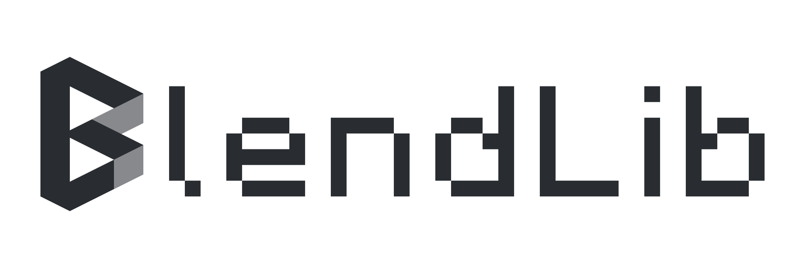

# BlendLib 带字标志：参数化矢量母版

沿用项目现有带字图标的横向组合：**折面 B 作为首字母，后接 `lendLib`，整体读作 `BlendLib`**。
这是本次用户明确选择的组合方式。`L` 保持大写，其余字形大小写按原名称，不重复排一个字体 B。



上图是便于查看的白底预览。SVG 母版与母版 PNG 均为透明背景。
2026-09-13 经项目所有者确认，本版已采用为正式带字标志；正式白底版本及同步路径见
[采用记录](../wordmark-adoption-2026-09-13.md)。

## 交付文件

| 文件 | 用途 |
| --- | --- |
| [透明 SVG 母版](./generated/blendlib-wordmark-master.svg) | 10 个闭合填充路径：3 个图形路径和 7 个真实字体字形路径；没有活文字、位图或字体依赖 |
| [透明 PNG](./generated/blendlib-wordmark.png) | 3066 × 1022 px，RGBA，真实 Alpha |
| [独立几何构造图 SVG](./generated/construction.svg) · [PNG](./generated/construction.png) | B 顶点、组合尺寸、基线、可见字距、字体像素网格和修正量 |
| [尺寸比例表](./generated/dimensions.md) · [CSV](./generated/dimensions.csv) | 尺寸、比例、顶点坐标、字形位置，均由脚本生成 |
| [参数文件](./parameters.json) | 图形、字体尺寸、字距、构图、配色和输出单位 |
| [生成脚本](./generate.py) · [几何模块](./geometry.py) | 从源 OTF 重新排版、提取轮廓、构造图形并导出全部文件 |
| [正式导出脚本](./export_official.py) | 同步正式透明/白底 PNG、文档副本及 2:1 分享预览 |
| [原图对照](./generated/comparison.png) | 原位图与新母版的整体比较 |
| [字体轮廓对照](./generated/font-outline-proof.png) | 原 OTF 经 FreeType 渲染，与 SVG 轮廓经另一渲染器渲染的对照 |
| [字形排版数据](./generated/layout.json) · [几何数据](./generated/geometry.json) | 字符、Glyph ID、原生 advance、边界、修正、路径与坐标 |
| [生成清单](./generated/manifest.json) · [SHA-256](./generated/SHA256SUMS) | 绑定参数、脚本、源字体、原图、引擎版本和交付文件 |
| [验证记录](./VERIFICATION.md) | 复现、参数变化、透明度、字体真实性和文件检查 |

辅助网格、尺寸线、基线和注释属于独立规范与验证图，母版中只保留标志本身。
整个包可迁移；提供的字体及其许可、原图快照都保存在 [assets](./assets/provenance.json) 中。

## 原图与字体基准

视觉基准为正式化前归档的 [原文字标](./assets/source-wordmark-white.png)，
来自版本 `1131673` 的 `blendlib-wordmark-white.png`，尺寸 2172 × 724、画布比例 3:1。
保留 B 的空间折面、双三角孔、石墨灰主体与两处浅灰回折面，保持横向组合。
本次按带字原图重新取色，不混用另一次导出的独立图标灰阶。

| 色彩 | 原图区域中值 | 统一色 |
| --- | --- | --- |
| 图形与文字主体 | RGB(40,44,49)、RGB(41,45,49) | `#292D31` |
| 上下浅灰折面 | RGB(134,136,140)、RGB(135,137,141) | `#87898D` |

取两区域中值的平均值，0.5 向上舍入；采样框和原图哈希见来源记录。
取消原位图的灰阶纹理，使用纯色填充。比例由原图测量、字体度量和尺寸关系确定，未引入黄金比例。

字体是用户提供的 **Minecraft.otf / Minecraft Medium / Version 001.000**，文件 SHA-256：

```text
ebc7a7be9f69479f02875af1fe79a2b93cc868b83be4f6369ecceb45fabe5ee6
```

字体的每 em 为 18 font units（下文记 fu），大写高度为 14 fu，小写 x-height 为 10 fu，
字形像素格为 2 fu。七个字形都从此文件提取，保持原字重与字宽，未做伪粗体、斜切或横向拉伸。
它与原位图中较粗的文字有差异；使用指定字体后，组合的自然字宽会缩短。

## 同一单位 u 下的构图

局部原点位于 B 的墨迹包围盒左上方；x 向右、y 向下。`1u=28 px` 是本次原尺寸导出的约定，
SVG 内坐标由 u 统一换算为输出坐标。图形、字体、间距和画布都使用同一套 u。

| 关系 | 默认值 |
| --- | --- |
| B 宽 × 高 | 14u × 21u，即 2:3 |
| 斜边方向 | 斜率 ±1/2，即 ±26.565051°；其余边竖直 |
| 立柱水平宽 s / 回折投影 d | 4u / 4u |
| 三角孔水平距离 r / 竖直边高 h | 6u / 6u |
| 两孔间距 g / 重复节距 p | 1u / 7u |
| 文字大写高度 | 15u，与 B 高度比为 5:7 |
| 文字基线 / 大写顶线 | y=19u / y=4u |
| 图形到第一个字形的可见间距 | 3.5u |
| 每对字母的可见间距 | 3.5u |
| `lendLib` 墨迹宽度 | 81u |
| 整个组合的墨迹宽度 | 98.5u |
| 画布 | 109.5u × 36.5u，即 3:1 |
| B 局部原点在画布中的位置 | (5.5u, 7.75u) |
| 原尺寸输出 | 3066 × 1022 px |

### B 的参数与顶点

```text
m = slope_rise / slope_run = 1/2
t = 2md                   = 4u      竖向带宽截距
h = 2mr                   = 6u      孔的竖直底边
p = h + g                 = 7u      两孔重复节距
W = s + r + d             = 14u
H = 2t + 2h + g           = 21u
a = m(r+d)                = 5u
M = (W − p/(2m), a+p/2)   = (7u, 8.5u)
G = (M.x+d, M.y+md)       = (11u, 10.5u)
```

全部 A–Q 顶点见自动生成的尺寸表。上、下孔相同，下孔为上孔向下平移 p；
折面交点 M、G 来自交线求解。主体以 evenodd 复合路径扣除两孔，再叠放两处浅灰面。
连续深灰底层覆盖共享边，减少相邻多边形抗锯齿导致的缝隙。

`t=4u` 是竖向截距，法向厚度为 `t/sqrt(1+m²)≈3.578u`。
`d=4u` 是水平回折投影距离；上浅灰面的可见总宽为 7u，由遮挡交线决定。
这些量不混称为同一个“笔画宽度”。

### 真实字体排版与轮廓

1. HarfBuzz 排版精确的 `lendLib`：`ltr / Latn / en`，开启 kern，关闭 liga、clig。
2. 读取实际 Glyph ID、cluster、advance 与 offset，确认七个字形无缺失或替代。
3. 以 `15u / 14fu = 15/14 u/fu` 等比缩放字体，用墨迹边界统一可见间距。
4. fontTools 从原字体的 CFF 数据提取闭合轮廓，统一翻转 y 轴并放置在基线上。
5. SVG 只保存填充路径。PNG 直接渲染这份 SVG，保持同一几何来源。

这里使用实际字体排版接口和轮廓提取接口，分别见
[HarfBuzz Python 接口](https://uharfbuzz.readthedocs.io/reference.html) 与
[fontTools SVGPathPen](https://fonttools.readthedocs.io/en/latest/pens/svgPathPen.html)。
本字体没有 kern/GPOS 表，实际七字排版的原生相邻墨迹间距都为 3 fu；开启 kern 不表示捏造了字偶距。

```text
原生可见间距 = 3fu × 15/14 = 45/14u
统一目标间距 = 3.5u = 49/14u
每个间隔附加 tracking = 49/14 − 45/14 = 2/7u
```

基线原本按文字墨迹框与 B 包围盒竖直居中得到 `y=(21+15)/2=18u`；
下移 1u 后为 y=19u，恰好与 B 的左下角 C 对齐。所有字母基线相同，未逐字上下挪动。

原尺寸下，1 fu 对应 30 px，字形像素格对应 60 px；七个字形的全部轮廓顶点落在整数像素上。
这保留了像素字的轴向直边。B 的斜边保留正常抗锯齿，不对其强制像素化。

## 修正记录

| 项目 | 基准 | 本次值 / 修正量 |
| --- | --- | --- |
| 文字竖直平衡 | 文字与 B 的墨迹框居中，基线 18u | 全部文字统一下移 **+1u**，基线 19u |
| 字体原生间距 | 相邻墨迹间距 45/14u | 每个间隔附加 **+2/7u**，统一到 3.5u |
| 单独字偶修正 | 在统一 tracking 以外 | **全部 0u** |
| 单字竖向修正 | 公共基线以外 | **全部 0u** |
| 单字横向/竖向变形 | 字体原始长宽比 | **0%**；x/y 等比 |
| 整体额外偏移 | 组合墨迹居中 | **x=0u、y=0u** |
| B 宽高比 | 原图阈值框 258:384 | 14:21，宽高比约减少 **0.78%** |
| 文字/B 高度比 | 原图约 270:384 | 15:21，相对增加约 **1.59%** |
| 图形到字体间距 | 原图折算约 3.554688u | 3.5u，约 **−0.054688u** |
| 原图文字底边 | 原图折算约 y=19.140625u | y=19u，约 **−0.140625u** |

按原图 B 高度归一到 21u 后，原图六个可见字距与本次值的变化如下：

| 字偶 | 原图约 / u | 本次 / u | 差量 / u |
| --- | ---: | ---: | ---: |
| l–e | 3.117188 | 3.5 | +0.382812 |
| e–n | 3.554688 | 3.5 | −0.054688 |
| n–d | 3.554688 | 3.5 | −0.054688 |
| d–L | 3.390625 | 3.5 | +0.109375 |
| L–i | 3.718750 | 3.5 | −0.218750 |
| i–b | 3.281250 | 3.5 | +0.218750 |

原图 `lendLib` 的墨迹宽折算约为 91.383u；指定字体排版后为 81u，约缩短 11.36%。
整体组合墨迹宽从约 109.047u 变为 98.5u。原图字形较粗，本次采用提供的 Medium 字体本身，
没有通过拉宽字形来补回原位图的宽度。画布继续保持 3:1，组合与留白随自然字宽重新求解。
图形高度占画布的比例从约 53.04% 变为 57.53%；左右留白统一为 5.5u。

这些原图数据是像素阈值框的近似测量，边缘阈值和纹理会影响读数，不是历史母版的精密坐标。
脚本复现依赖明确参数和真实字体数据，不依赖上述近似读数。

## 修改参数与复现

Python 3.10+，依赖固定于 [requirements.txt](./requirements.txt)。本次实际验证环境为 Python 3.11.15。
字体随包保存，运行时不读取系统字体，不访问网络；安装依赖这一步需要可用的包源。

Windows PowerShell，在解压后的资产包目录执行：

```powershell
python -m venv .venv
.\.venv\Scripts\python.exe -m pip install -r requirements.txt
.\.venv\Scripts\python.exe generate.py
.\.venv\Scripts\python.exe generate.py --check
```

默认输出到 `generated/`。`--check` 在内存中重建全部 14 个输出并逐字节比较，不改写输出文件。
清单不含运行时间戳；来源记录中的原始字体路径只是固定的来源信息，不是运行依赖。

复制参数文件后，可输出到独立目录：

```powershell
.\.venv\Scripts\python.exe generate.py --params custom.json --out custom-output
.\.venv\Scripts\python.exe generate.py --params custom.json --out custom-output --check
```

主要参数：

| 参数路径 | 默认值 | 修改影响 |
| --- | ---: | --- |
| `emblem.*` | 见参数文件 | 联动顶点、折面交点、孔形和 B 尺寸 |
| `typography.cap_height_u` | 15 | 字体等比缩放，字宽与画布跟随计算 |
| `typography.visible_letter_gap_u` | 3.5 | 从字体真实度量重新计算 tracking |
| `typography.emblem_gap_u` | 3.5 | B 右端到 l 墨迹左端的间距 |
| `typography.baseline_optical_shift_u` | +1 | 整行文字相对矩形居中的竖向修正 |
| `composition.horizontal_padding_u` | 5.5 | 两侧基础留白，画布宽度联动 |
| `composition.canvas_ratio` | 3 | 画布宽高比；画布高度随自然组合宽度求解 |
| `composition.offset_x_u / offset_y_u` | 0 / 0 | 整体额外偏移 |
| `composition.minimum_clearance_u` | 3.5 | 四边最小留白约束，不自动拉伸图形 |
| `palette.graphite / fold` | 见色表 | 统一纯色填充 |
| `export.pixels_per_u` | 28 | SVG/PNG 的统一输出尺度 |

例如仅将字母间距改为 4u，脚本会输出 3150 × 1050 px 的新组合，字形比例不变。
只将输出单位改为 56 px/u，则得到 6132 × 2044 px 的同构放大版。

几何参数须满足 `s < M.x < s+r < G.x < W` 且 `ms < H/2`；字体墨迹须处于 B 的高度范围内，
画布留白须满足最小值。所有数值须有限，尺寸为正；文字内容与大小写固定。
脚本还要求画布尺寸乘以 px/u 后为整数，避免输出时悄悄改变比例。
不兼容时应调整输出单位，不能单独拉伸宽或高。

任意参数都能影响像素落点。默认配置及其整数倍输出已对齐像素；其他配置是否对齐，
由 `layout.json` 的 `glyph_vertices_on_integer_export_pixels` 和渲染报告说明。
比例变化后的新构造图应重新查看，不能把默认配置的视觉复核当作所有参数组合均已验收。

字体原文件及随附的 [SIL Open Font License 1.1](./assets/FONT-LICENSE.txt) 原样随包保留。

## 正式资源同步

在仓库内安装相同依赖后，从仓库根目录执行：

```powershell
python docs/assets/branding/parametric-wordmark/generate.py
python docs/assets/branding/parametric-wordmark/export_official.py
python docs/assets/branding/parametric/export_official.py
python docs/assets/branding/parametric-wordmark/export_official.py --check
python docs/assets/branding/parametric/export_official.py --check
```

第二步同步两份 3066 × 1022 正式带字 PNG、`docs/assets/blendlib-logo.png` 白底副本和
1774 × 887 分享预览；第三步通过既有独立 B 流程刷新四份正式 PNG 的共享校验和。
带字透明 PNG 与母版 PNG 字节一致；白底版本从透明图合成，不另行绘制字形。

分享预览直接缩放同一 SVG，在固定 2:1 画布中以 14 px/u 输出。默认母版缩放为 1533 × 511，
相对精确居中向右、向下各移动 0.5 px，使首字墨迹边界和公共基线落在整数像素上。
该适配修正不写回母版参数。位置、修正量及文件哈希见 [正式清单](../official-wordmark-manifest.json)。

生成脚本仍可脱离仓库运行；正式导出脚本需要 BlendLib 仓库目录结构。
本次更新本地带字正式资源；独立 B 的模组资源继续使用既有版本，公开平台素材需要另行上传。
