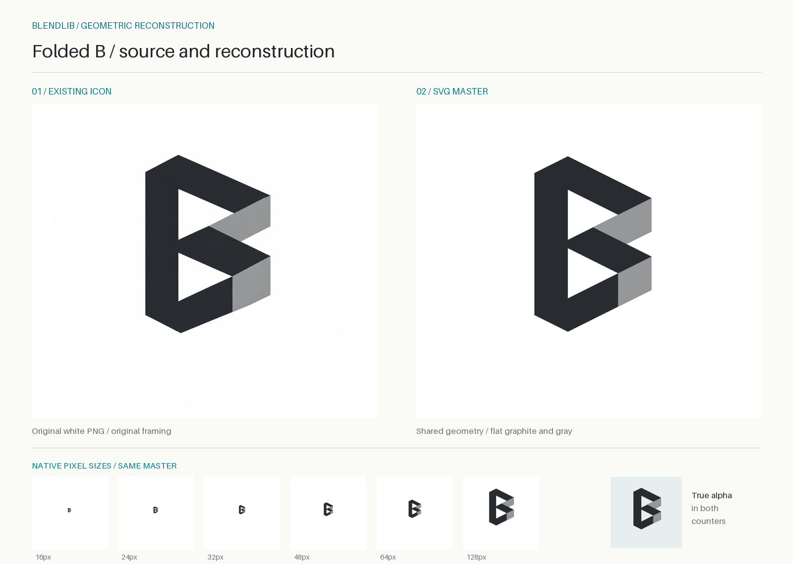

# BlendLib 折面 B：参数化矢量母版

2026-09-13 经项目所有者确认，本目录的 SVG 设为独立 B 图标正式母版。
项目正式 PNG 和模组图标由其统一导出；见 [正式资源入口](../README.md) 与
[正式化记录](../adoption-2026-09-13.md)。

保留现有图标的 B 形轮廓、上下两个三角负形、深灰主体和右侧两处浅灰回折面。
将位图里略有差异的斜边、孔形和灰阶统一为可计算的直线与纯色填充。
本次重构对象是独立图标；文字组合标不在本资产包范围内。



## 交付入口

| 文件 | 用途 |
| --- | --- |
| [SVG 母版](./generated/blendlib-icon-master.svg) | 36u 方形画布，真实透明背景和镂空；默认 1152 × 1152 px |
| [白底 SVG](./generated/blendlib-icon-white.svg) | 同一母版加纯白底，路径与位置完全相同 |
| [紧边界符号 SVG](./generated/blendlib-symbol.svg) | 14u × 21u，默认 448 × 672 px，供排版软件放置；需另留安全距离 |
| [几何构造图 SVG](./generated/construction.svg) · [PNG](./generated/construction.png) | 顶点、斜向网格、尺寸链、公式、画布与安全距离 |
| [参数 JSON](./parameters.json) | 可编辑的结构、构图、色彩与输出尺寸参数 |
| [生成脚本](./generate.py) | Python 3.10+；生成矢量文件只使用标准库 |
| [顶点与结构数据](./generated/geometry.json) | 全部顶点、闭合环、派生尺寸、面积和画布定位 |
| [来源记录](./reference/source.json) | 原图哈希、取色区域、人工读取的参考顶点 |
| [生成清单](./generated/manifest.json) · [校验和](./generated/SHA256SUMS) | 绑定参数、脚本、来源和各矢量制品 |
| [验证说明](./VERIFICATION.md) | 复现、参数变更、SVG 结构与实际渲染检查 |

母版只有三个填充路径：`body`、`upper-fold`、`lower-fold`，没有位图、字体、
描边、渐变、滤镜或外部引用。背景和两个孔均为真实透明区域。
构造图中的网格、顶点标注和青色尺寸线不属于标志。

## 视觉基准与规范化取舍

以本次重构开始前的白底图标 `docs/assets/branding/blendlib-icon-white.png` 为构图基准，
保存其逐字节副本于 [reference](./reference/blendlib-icon-white.png)。原有透明 PNG 是
另一次导出，尺寸相同但图形占比与边缘不同，因此没有混用两套坐标。

| 识别关系 | 原图情况 | 本次规范 |
| --- | --- | --- |
| 折面 B、两个三角孔 | 保留的核心结构 | 保留；下孔由上孔向下平移 7u 得到 |
| 外形宽高 | 人工顶点读数约 520 : 742 | 14 : 21，即 2 : 3；宽高比约收窄 4.9% |
| 倾斜边 | 位图中各边角度略有不同 | 统一为斜率 ±1/2，角度 ±26.565°；其余边竖直 |
| 主体颜色 | 取样中值 RGB(40,43,48) | 单一石墨灰 `#282B30` |
| 两处折面 | 取样中值约 RGB(149,150,152)、RGB(150,151,153) | 统一为 `#969799` |
| 方形构图 | 图形中心略偏右、偏上 | 保持这一关系；相对居中位置偏移 (+0.5u, −2u) |
| 表面与边缘 | 灰阶纹理、抗锯齿、细微不齐 | 纯色、直线、共享顶点，取消纹理 |

比例是本次重构建立的规范，不是从位图恢复出的历史设计规范，也不是逐像素描摹。
人工读取的原图顶点仅用于说明取舍，不参与生成，精度不应解读为亚像素测量。

## 统一单位与参数

坐标向右为 x 正方向，向下为 y 正方向。几何使用无量纲的 `u`；默认输出时
`1u = 32 px`。调整 `unit_px` 只改变 SVG 的固有输出尺寸，`viewBox` 与几何比例不变。

| JSON 路径 | 符号 | 默认值 | 含义 |
| --- | --- | --- | --- |
| `geometry.stem_u` | s | 4 | 左立柱的水平宽度 |
| `geometry.counter_run_u` | r | 6 | 三角孔从竖直底边到尖端的水平距离 |
| `geometry.return_u` | d | 4 | 孔尖端到右端的水平回折投影距离 |
| `geometry.slope_rise / slope_run` | m | 1 / 2 | 斜边的绝对斜率；默认并非 30° 等轴测 |
| `geometry.counter_gap_u` | g | 1 | 在 x=s 处，上孔下端与下孔上端的竖向间距 |
| `composition.canvas_u` | C | 36 | 母版方形画布边长 |
| `composition.offset_x_u` | Δx | +0.5 | 相对符号包围盒水平居中的偏移 |
| `composition.offset_y_u` | Δy | −2 | 相对符号包围盒竖向居中的偏移 |
| `composition.clear_space_u` | c | 4 | 符号包围盒外四边最小安全距离；只做约束，不缩放图形 |
| `export.unit_px` | u | 32 px | 固有输出尺寸；设为 16 可得到 576 px 方形 SVG |
| `export.graphite` | — | `#282B30` | 深灰主体填色 |
| `export.fold` | — | `#969799` | 两处浅灰折面共用填色 |
| `export.background` | — | `#FFFFFF` | 白底派生版底色；不写入透明母版 |

### 派生关系

```text
t = 2md                 = 4u       上下带的竖向截距，亦为右端竖边长
h = 2mr                 = 6u       三角孔竖直底边长
p = h + g               = 7u       两孔的竖向重复节距
W = s + r + d           = 14u      符号宽度
H = 2t + 2h + g         = 21u      符号高度
a = m(r + d)            = 5u       顶部尖点 A 到右上点 I 的竖向投影

ox = (C − W)/2 + Δx     = 11.5u   符号局部坐标原点在画布中的 x
oy = (C − H)/2 + Δy     = 5.5u    符号局部坐标原点在画布中的 y
```

`t=4u` 是竖向量，不是垂直于斜边的厚度；相应法向距离为
`t / sqrt(1+m²) ≈ 3.578u`。`d=4u` 是回折投影距离，也不是上浅灰面的整个可见宽度。
上折面受中间深灰带遮挡，其左端 M 和凹口 G 由交线计算，默认可见总宽 7u。
这一处理保留了原图两处浅灰面不同的可见轮廓。

两个三角孔的面积均为 `r×h/2 = 18u²`。
默认所有顶点均落在 0.5u 网格上；自定义任意数值后不自动吸附网格，以免破坏公式。

### 顶点表

以下为符号局部坐标，未加画布平移。图中 A–Q 与脚本、JSON 使用同一命名。

| 点 | 一般式 (x, y) | 默认坐标 / u |
| --- | --- | --- |
| A | (s, 0) | (4, 0) |
| B | (0, ms) | (0, 2) |
| C | (0, H−ms) | (0, 19) |
| D | (s, H) | (4, 21) |
| E | (W, H−a) | (14, 16) |
| F | (W, a+p) | (14, 12) |
| G | (W−p/(2m)+d, a+p/2+md) | (11, 10.5) |
| H | (W, a+t) | (14, 9) |
| I | (W, a) | (14, 5) |
| J | (s, t) | (4, 4) |
| K | (s, t+h) | (4, 10) |
| L | (s+r, t+h/2) | (10, 7) |
| M | (W−p/(2m), a+p/2) | (7, 8.5) |
| N | (s, t+p) | (4, 11) |
| O | (s, t+p+h) | (4, 17) |
| P | (s+r, t+p+h/2) | (10, 14) |
| Q | (s+r, H−mr) | (10, 18) |

符号 `H` 在公式中表示总高度；顶点表第一列的 H 是右上回折面的下端点。

```text
外轮廓： A → I → H → G → F → E → D → C → B → A
上孔：   J → L → K → J
下孔：   N → P → O → N
上折面： M → I → H → G → M
下折面： P → F → E → Q → P
```

主体以 `fill-rule="evenodd"` 一次填充外轮廓并扣掉两孔，浅灰面叠放其上。
共享边的深灰底层连续，避免相邻独立多边形在抗锯齿时露出白缝。
所有路径均闭合，折面与孔洞端点来自同一坐标表。

### 画布与使用

默认画布 36u，图形原点 (11.5u, 5.5u)，四边留白依次为左 11.5u、上 5.5u、
右 10.5u、下 9.5u。图形占画布宽 38.89%、高 58.33%，延续原白底图标的宽留白。
4u 的安全距离以符号包围盒为基准；紧边界 `blendlib-symbol.svg` 不含安全距离。

保留整体比例。常规浅色背景使用透明母版，深色背景使用白底版。
母版未制作反白版本。已附 16、24、32、48、64、128 px 的实际栅格对照；
16 px 方形画布内的符号仅约 6.2 × 9.3 px，适合判断轮廓，折面细节有限。
需要阅读两个孔和折面时，以 32 px 及以上作为本次预览的使用建议。

## 复现和修改

在本资产包目录执行。Python 标准库即可生成 SVG、几何数据和清单，无网络请求。

```powershell
cd 'D:\BlendLib\docs\assets\branding\parametric'
python generate.py
python generate.py --check
```

`--check` 重新计算期望内容并逐字节对比 7 个核心文件，只读且不改写结果。
清单绑定规范化参数 JSON、换行归一化后的脚本哈希和参考图哈希，输出不含时间戳
或机器路径。参考图采用资产包内的副本，因此整个文件夹可迁移后复现。

复制 `parameters.json` 后调整参数，建议输出到独立目录：

```powershell
python generate.py --params custom.json --out custom-output
python generate.py --params custom.json --out custom-output --check
```

例如仅将 `export.unit_px` 从 32 改为 16，会将方形 SVG 的固有尺寸从 1152 px
改为 576 px，图形和留白比例不变。改 g 会联动节距、总高、遮挡交点和画布定位；
改 m 会联动全部斜边、孔高、带宽和总高。不要只拖动某个折面顶点来修改母版。

脚本要求几何数值、画布、安全距离、输出单位为有限正数，偏移允许正负。
以下交点顺序保证仍是同一折面拓扑：

```text
s < W − p/(2m) < s+r < W − p/(2m) + d < W
```

此外要求 `ms < H/2`，避免左侧两个角点发生次序反转。顶点须位于符号框内，
画布四边必须满足安全距离。违反约束会报错，
不生成一份自交或折面塌陷的“成功”文件。颜色须为互不相同的六位十六进制色；
参数实验是否保留足够视觉对比，仍需检查预览。

### 可选 PNG 预览

预览通过真实 SVG 渲染，不是另一套手绘多边形。此步骤使用额外的两个库，
本次验证版本见 [requirements-preview.txt](./requirements-preview.txt)：

```powershell
python -m pip install -r requirements-preview.txt
python generate.py --render
```

生成 768 px 白底与透明 PNG、1600 × 1100 构造图 PNG、1600 × 1140 对照图和
`proof-report.json`。预览报告绑定当次核心清单哈希；更改参数后需要重新执行
`--render`。单独执行默认生成不会更新已有预览。不同 SVG 渲染器或字体的栅格化
可能有抗锯齿和构造图文字差异，SVG 母版没有字体依赖。

### 正式 PNG 与模组资源

在 BlendLib 仓库内执行以下命令，将母版导出为 1254 × 1254 的正式 PNG，并同步
模组资源、正式资源校验和与 [导出清单](../official-icon-manifest.json)：

```powershell
python export_official.py
python export_official.py --check
```

[export_official.py](./export_official.py) 使用与预览相同的固定版本依赖，先核对
矢量母版是否与参数一致，再导出透明 PNG。白底 PNG 由这一透明图逐像素合成到纯白底，
模组图标则复制白底 PNG 的相同字节。此命令写入仓库正式资源路径，
因此只在仓库的本目录运行；迁移后的独立资产包仍可使用 `generate.py` 生成 SVG。

原始位图在 `reference/` 和 Git 历史中保留，文字组合标沿用既有 PNG。
公开平台的已上传图标不随本地导出自动更新。
现有仓库许可继续适用；此文档不作额外第三方商标或字体授权声明。
