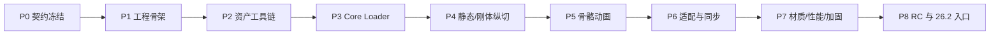

# BlendLib 实施计划

状态：待实施。本文是实施时的来源真相；如需改变已接受架构，先更新设计文档并记录新的 ADR。

## 1. 目标

在独立目录 `D:\BlendLib` 建立可发布的 Fabric 库模组，首发目标为 Minecraft 26.1.2。最终交付：

- `blendlib-fabric-1.0.0+26.1.2.jar`
- Blender add-on ZIP
- Showcase 模组
- 开发者文档、Javadoc、资产 schema
- 自动测试、dedicated server smoke、客户端视觉与性能证据

本计划不授权自动发布到 Maven Central、Modrinth、CurseForge 或公开 GitHub；公开发布和许可证在 release candidate 时由用户单独确认。

## 2. 全局约束

- Java 25。
- Fabric Loader 0.19.3。
- Fabric API `0.154.2+26.1.2`。
- 运行 JAR 不包含 `.blend`。
- common 模块不得引用客户端类。
- core 模块不得依赖 Minecraft/Fabric。
- 不直接调用 OpenGL。
- 不在渲染热路径进行文件读取或模型解析。
- GLB 输入按不可信资源处理。
- 不把视觉动画事件用作服务端权威玩法事件。
- 不从 LiyMod 复制魔剑、修仙或 shaderpack 专用逻辑。
- 每个阶段结束必须有新的测试证据；仅“能编译”不能通过阶段 gate。
- 实施期间如 LiyMod 工作区仍有未归属改动，只读参考，不在该工作区重构。

## 3. 计划中的仓库布局

```text
D:\BlendLib\
├─ settings.gradle.kts
├─ build.gradle.kts
├─ gradle.properties
├─ gradle\
├─ LICENSE-PENDING
├─ docs\
│  ├─ architecture.md
│  ├─ asset-format-v1.md
│  ├─ api-v1.md
│  ├─ blender-workflow.md
│  └─ performance-baseline.md
├─ blendlib-api\
├─ blendlib-core\
├─ blendlib-fabric-common\
├─ blendlib-fabric-client\
├─ blendlib-showcase\
├─ blender-addon\
├─ test-assets\
└─ scripts\
```

发布构建把 api/core/common/client 组合为一个 Fabric 运行制品；showcase 和 Blender add-on 单独产出。

## 4. 阶段 Gate



任何阶段 gate 失败时停止推进，修复当前阶段，不以“后面再补”绕过。

### 需求追踪矩阵

| 架构要求 | 主要实现阶段 | 阶段证据 |
|---|---|---|
| 运行时不读取 `.blend` | P2、P8 | JAR 内容测试、导出工具制品 |
| core/API 不依赖 Minecraft | P1、P3 | 依赖/字节码边界测试 |
| 严格 GLB 档案与安全上限 | P2、P3 | canonical/malformed fixtures |
| 原子资源重载与 missing model | P4 | reload、失败资产和 handle 生命周期测试 |
| 静态/刚体渲染 | P4 | 物品与世界双挂载 showcase |
| 骨骼蒙皮、状态与混合 | P5 | golden pose、双实例和视觉验收 |
| 实体/方块实体同步 | P6 | 双客户端、乱序和 tracking-start 测试 |
| 标准材质 fallback | P4、P7 | 无 shaderpack 与 Iris/Sodium smoke |
| 有界缓存与无重载泄漏 | P5、P7 | cache 指标、20 次 reload |
| dedicated server 安全 | P1 至 P8 | 每阶段 server smoke |
| 26.1.2/26.2 制品隔离 | P1、P8 | 独立 adapter 构建与 core fixture 复用 |
| 消费者只依赖公共 API | P1、P6、P8 | 两个 compile fixture 和空白 consumer |

## 5. P0：契约冻结

目标：把设计包转入独立仓库并固定首版边界。

### 任务

- [ ] 创建 `D:\BlendLib`，初始化独立 Git 仓库。
- [ ] 使用 `Liy/` 前缀创建实现分支。
- [ ] 复制本设计包到新仓库 `docs/`。
- [ ] 建立 ADR 索引并标记 ADR-001 至 ADR-008 为 Accepted。
- [ ] 固定 mod id、包名、Maven 坐标占位和版本规则。
- [ ] 把 descriptor 示例转成正式 JSON Schema。
- [ ] 固定 GLB `rigid_v1`/`skinned_v1` 支持矩阵。
- [ ] 固定错误码命名和 hard limits。
- [ ] 建立 `CHANGELOG.md` 与 API stability 规则。

### Gate

- 文档之间不存在目标版本、坐标、资源路径或 v1 支持范围冲突。
- Schema 示例可以被标准 JSON parser 读取。
- 所有未决项都明确标成 release/legal 决策，而非隐藏技术待办。

## 6. P1：工程骨架与边界测试

目标：建立可编译的多模块工程，并先锁定依赖方向和 dedicated server 安全。

### 任务

- [ ] 配置 Gradle Wrapper、Loom、Java toolchain 25。
- [ ] 创建 `blendlib-api` 与 `blendlib-core` 纯 Java 模块。
- [ ] 在纯 API 中实现 `BlendResourceId`；Fabric 侧另提供 `Identifier` 转换，不让 core 传递依赖 Minecraft。
- [ ] 创建 Fabric common/client 模块或等价 split source set。
- [ ] 创建 `blendlib-showcase`，只通过公共 API 依赖 BlendLib。
- [ ] 编写 `fabric.mod.json`，common/client entrypoint 分离。
- [ ] 添加 ArchUnit 或自定义字节码/源码边界测试：
  - core 不引用 `net.minecraft`。
  - common 不引用 `net.minecraft.client`。
  - public API 不引用 `impl`。
- [ ] 添加最小 dedicated server smoke。
- [ ] 添加 API consumer compile fixture。
- [ ] 添加 `check`, `runServer`, `runClient`, `buildRelease` 入口。

### 验证

```powershell
$env:JAVA_HOME='C:\Program Files\Java\latest\jdk-25'
.\gradlew.bat clean check
.\gradlew.bat :blendlib-showcase:runServer
```

### Gate

- 全模块编译和测试通过。
- dedicated server 到达 `Done`。
- 服务端类路径扫描中不存在客户端类加载错误。
- showcase 不能访问任何 `impl` package。

## 7. P2：Blender 资产工具链

目标：先让资产可确定地导出、校验和复现，再写运行时渲染。

### 任务

- [ ] 创建 Blender 5.x add-on manifest 和侧栏面板。
- [ ] 支持 namespace、model id、profile、输出资源根配置。
- [ ] 实现 Collection 选择与唯一根检查。
- [ ] 实现坐标/单位规范化。
- [ ] 发现并列出 Actions/NLA 动画。
- [ ] 把受支持动画烘焙/重采样为 LINEAR 或 STEP；导出后拒绝意外 CUBICSPLINE。
- [ ] 校验 UV0、normals、材质槽、重复节点名和 skin 权重。
- [ ] 烘焙受支持约束/修改器；对不支持内容给出明确错误。
- [ ] 导出 GLB，不把相机/灯光/物理系统打入运行资产。
- [ ] GLB 只保留命名材质槽，不嵌入运行贴图；descriptor 引用外置 Minecraft PNG。
- [ ] 把材质贴图复制为外置 Minecraft PNG。
- [ ] 生成 descriptor v1。
- [ ] 导出后读取 GLB 并检查：
  - magic/version/declared length。
  - chunk bounds。
  - POSITION/NORMAL/TEXCOORD_0。
  - triangle/index。
  - 预期动画名。
  - bounds 和 node 数。
- [ ] 提供 Blender headless CLI：

```powershell
& 'D:\Program Files\Blender\blender.exe' `
  --background `
  --python blender-addon\scripts\export_blendlib.py `
  -- `
  --blend test-assets\dragon\source.blend `
  --project-root blendlib-showcase
```

- [ ] 创建最小 static、rigid animation、skinned animation 三份 canonical fixture。
- [ ] 保存 fixture 的结构摘要和 hash，避免 Blender 升级静默改变导出。

### Gate

- 同一 `.blend` 连续两次导出的规范化 GLB/descriptor 结构一致。
- 三份 fixture 均通过导出后 validator。
- 坐标映射、正面方向、bounds 和动画名称测试通过。
- 参数解析只读取 Blender CLI `--` 后参数。

## 8. P3：严格 Core Loader 与动画数学

目标：在完全不接触 Minecraft 的条件下构造可信 `ModelAsset`。

### 任务

- [ ] 实现资源无关的 `AssetBytes`/`AssetResolver` 接口。
- [ ] 实现 GLB header/chunk reader。
- [ ] 实现 bufferView/accessor reader 和所有边界检查。
- [ ] 实现 strict descriptor decoder。
- [ ] 实现 node hierarchy 和循环检测。
- [ ] 实现 rigid mesh/node 映射。
- [ ] 实现 skin/joints/inverse bind matrix。
- [ ] 实现 animation sampler：
  - LINEAR vector。
  - STEP。
  - quaternion slerp。
- [ ] 实现不可变 `ModelAsset`、`Skeleton`、`AnimationClip`、`SocketTable`。
- [ ] 实现 bounds 计算。
- [ ] 实现稳定 diagnostics/error codes。
- [ ] 实现所有 hard limits 和 URI/path 限制。
- [ ] 添加 malformed fixtures：
  - 错误 declared length。
  - chunk 越界。
  - accessor 越界。
  - 非法 index。
  - node cycle。
  - NaN transform。
  - 非单调 animation time。
  - 超限节点/骨骼。
  - 未支持 required extension。
- [ ] 对 Khronos SimpleSkin/AnimatedCube 等样本建立兼容 fixture；仅断言 v1 支持部分。

### 测试优先顺序

1. 先写 header/accessor 的失败测试。
2. 再实现容器读取。
3. 先写坐标/层级 golden tests。
4. 再实现 rigid scene。
5. 先写 skinning math tests。
6. 再实现 skin。
7. 先写 interpolation/state tests。
8. 再实现动画。

### Gate

- `blendlib-core` 单独 `test` 通过。
- core JAR 不含 Minecraft/Fabric 类引用。
- malformed assets 全部得到预期稳定错误码。
- canonical fixtures 的 node/vertex/index/clip/bounds golden 值匹配。
- parser fuzz/smoke 不出现数组越界、无限递归或 OOM。

## 9. P4：资源重载与静态/刚体纵切

目标：完成第一条真正可见的端到端路径。

### 任务

- [ ] 实现 `BlendModelKey` 到 descriptor 路径规则。
- [ ] 实现 client resource scan 和 resource-pack priority。
- [ ] 实现 prepare/apply 两阶段 reload。
- [ ] 实现 generation-based immutable registry。
- [ ] 实现 missing model。
- [ ] 实现基础材质到标准 RenderType 的映射。
- [ ] 实现 `ModelRenderSnapshot`。
- [ ] 实现后端 SPI。
- [ ] 实现 26.1.2 static/rigid backend。
- [ ] 实现物品 `blendlib:model` special renderer。
- [ ] 实现基础 entity renderer builder。
- [ ] 实现 bounds/extents/culling。
- [ ] Showcase 接入：
  - 静态物品。
  - 带 Idle 的刚体实体或展示对象。
- [ ] 加入 `/blendlib assets|inspect|diagnostics`。
- [ ] 验证 F3+T/resource reload 后模型替换和旧资源释放。

### Gate

- Showcase 中同一模型能在物品和世界对象两处显示。
- 轴向、原点、缩放和贴图正确。
- F3+T 或等价客户端资源重载能替换模型。
- 损坏 descriptor 使用 missing model，并只报告一次主错误。
- submit 调用图中不存在资源 I/O/JSON/GLB 解析。
- dedicated server 继续通过。

## 10. P5：AnimationController、刚体动画和骨骼蒙皮

目标：完成 v1 的动画核心。

### 任务

- [ ] 实现 `BlendInstanceKey` sealed variants。
- [ ] 实现 client instance registry 和生命周期清理。
- [ ] 实现单 `main` controller：
  - initial state。
  - trigger。
  - loop。
  - non-loop + next。
  - speed。
  - cross-fade。
  - sequence correction。
- [ ] 实现刚体 node palette。
- [ ] 实现 skinned bone palette。
- [ ] 实现 CPU skinning v1 backend。
- [ ] 实现 pose cache 与距离更新 bucket。
- [ ] 实现 animation visual event dispatch。
- [ ] 实现 socket world transform 查询。
- [ ] Showcase 实体接入 idle/walk/attack。
- [ ] 加入 blend、乱序 correction、world disconnect cleanup 测试。

### Gate

- idle、walk、attack 的状态切换与预期时长一致。
- quaternion 插值无翻转和 NaN。
- 同一资产的两个实例可以处于不同动画时间。
- socket 在动画过程中跟随正确骨骼。
- world disconnect 后 instance/controller cache 归零。
- 远距离/不可见实例不会保持最高动画更新频率。

## 11. P6：实体/方块实体适配与服务端同步

目标：形成类似成熟库模组的低调用成本。

### 任务

- [ ] 定稿 entity renderer builder 公共 API。
- [ ] 定稿 block entity renderer builder 公共 API。
- [ ] 提供低级 renderer submit API。
- [ ] 实现 entity animation payload。
- [ ] 实现 block entity animation payload。
- [ ] 实现 sequence/start tick/speed/seed/persistent。
- [ ] 实现 tracking start 持久状态同步。
- [ ] 实现未知目标短 TTL 等待队列。
- [ ] 实现断线、换维度、entity id 复用保护。
- [ ] Showcase 服务端触发 attack。
- [ ] Showcase 方块实体播放 persistent loop。
- [ ] 写一个不依赖 BlendLib `impl` 的第二 consumer compile fixture。

### Gate

- 两个客户端观察到相同的服务端动画起点。
- 乱序包不会倒退状态。
- 新开始追踪的客户端获得当前持久状态。
- transient 状态不会错误持久化。
- entity id 在重连/换维度后不会命中旧实例。
- 公共 API 示例与实际 showcase 完全一致。

## 12. P7：材质扩展、性能和安全加固

目标：达到可以发布 release candidate 的稳定性。

### 任务

- [ ] 完成 `MaterialExtensionDecoder`/resolver SPI。
- [ ] 验证 opaque/cutout/translucent/additive/emissive。
- [ ] 进行 Iris/Sodium smoke。
- [ ] 在无 shaderpack 下验证 fallback。
- [ ] 建立 100 rigid/25 skinned 参考场景。
- [ ] 用 JFR/Profiler 记录 p50/p95、allocation、cache size。
- [ ] 验证静态/刚体路径无顶点数比例的每帧分配。
- [ ] 执行 20 次 resource reload leak test。
- [ ] 验证 malformed/超限资源包不会造成 OOM 或无限日志。
- [ ] 对日志做 generation 级去重。
- [ ] 对 API、schema、payload 做兼容性审查。
- [ ] 如果 CPU skinning 未达目标：
  - 先验证 culling/LOD/pose cache。
  - 仍失败则实现 GPU skinning backend。

### Gate

- 参考场景稳定达到设计文档中的 60 FPS 目标。
- 20 次 reload 后旧 backend handle 不增长。
- steady-state cache 全部在配置上限内。
- 无 shaderpack、Iris/Sodium 环境均无致命渲染错误。
- 公开 API 没有暴露 mutable core arrays 或 Minecraft 内部 GL 对象。

## 13. P8：Release Candidate 与 26.2 适配入口

目标：形成可交付的 `1.0.0-rc.1+26.1.2`，并证明 core 可以被下一版本适配。

### 任务

- [ ] 冻结 asset schema v1。
- [ ] 冻结 public API v1。
- [ ] 完成 Javadoc 和开发者教程。
- [ ] 完成 Blender 建模/导出清单。
- [ ] 完成错误码索引和排错指南。
- [ ] 构建 sources/javadoc/runtime/showcase/add-on 制品。
- [ ] 在空白 consumer 模组中从本地 Maven 引用 RC。
- [ ] 在隔离 dedicated server 和 client 中安装验证。
- [ ] 生成制品 SHA-256、依赖清单和第三方许可证清单。
- [ ] 请求用户决定：
  - 最终公开名称。
  - 许可证。
  - 是否公开源码。
  - 发布渠道。
- [ ] 创建独立 `fabric-26.2` adapter spike，只要求：
  - core tests 原样通过。
  - 同一 descriptor/GLB fixture 可加载。
  - 一个静态 showcase 可提交。
- [ ] 26.2 spike 不得反向污染 v1 API。

### Gate

- `1.0.0-rc.1+26.1.2` 全部 release checks 通过。
- 空白消费者仅使用公开 API 即可编译运行。
- dedicated server 和真实客户端均有证据。
- 用户完成发布/许可证选择后才进入正式发布。

## 14. 每阶段统一验证命令

实际 Gradle task 名在 P1 固定后更新本节。预期入口：

```powershell
$env:JAVA_HOME='C:\Program Files\Java\latest\jdk-25'
.\gradlew.bat clean check
.\gradlew.bat :blendlib-core:test
.\gradlew.bat :blendlib-showcase:runServer
.\gradlew.bat buildRelease
git diff --check
git status --short --branch
```

客户端渲染阶段额外执行：

```powershell
.\gradlew.bat :blendlib-showcase:runClient
```

视觉验收至少覆盖：

- 正面方向。
- 根原点。
- 实体地面位置。
- 物品 GUI/手持 transform。
- 动画循环点。
- attack → idle 混合。
- 两个实例不同相位。
- socket 跟随。
- 资源重载前后。
- missing model。
- 无 shaderpack fallback。

## 15. 交付证据模板

每个阶段结束记录：

```text
Phase:
Commit:
Files:
Automated tests:
Build:
Dedicated server:
Client/manual:
Performance:
Known gaps:
Gate: PASS/FAIL
Next phase:
```

`Gate: FAIL` 时不得开始下一阶段。

## 16. 风险登记

| 风险 | 影响 | 缓解 |
|---|---|---|
| 26.1.2/26.2 渲染 API 差异 | adapter 重写 | core/snapshot/backend 边界 |
| Blender 版本改变 Action/NLA 导出 | clip 丢失或重命名 | add-on 固定导出流程与 hash/golden fixture |
| 轴向重复转换 | 模型旋转/镜像 | canonical 坐标测试；只允许边界转换一次 |
| CPU skinning 成本过高 | 大量实体掉帧 | culling、LOD、pose cache、GPU backend 预留 |
| 资源重载泄漏 | 显存/内存增长 | generation handle 和 20 次 reload gate |
| client 类泄漏到 common | dedicated server 崩溃 | 模块边界测试和 server smoke |
| GLB 恶意/损坏 | OOM、越界、无限递归 | hard limits、严格 parser、fuzz/malformed fixtures |
| 网络乱序/实体 ID 复用 | 动画串实例 | session key、sequence、disconnect cleanup |
| shaderpack 特殊识别差异 | 材质观感不同 | 标准 fallback、扩展 SPI、Iris smoke |
| 公共 API 过早暴露内部结构 | 无法演进 | 小 API、不可变 handle、showcase 只用 api |

## 17. 明确延后

下列内容只有新设计/ADR 批准后才能加入，不得在 v1 实施过程中顺手扩张：

- NeoForge/Forge。
- 1.21.x 或其他历史 Minecraft 分支。
- morph target。
- cloth/rigid body physics。
- root motion 权威移动。
- ItemStack 持久同步动画。
- 多 controller/bone mask/additive layer。
- Draco/Meshopt。
- 任意远程模型下载。
- 运行时 Blender/FBX 导入。
- 完整 PBR shaderpack。
